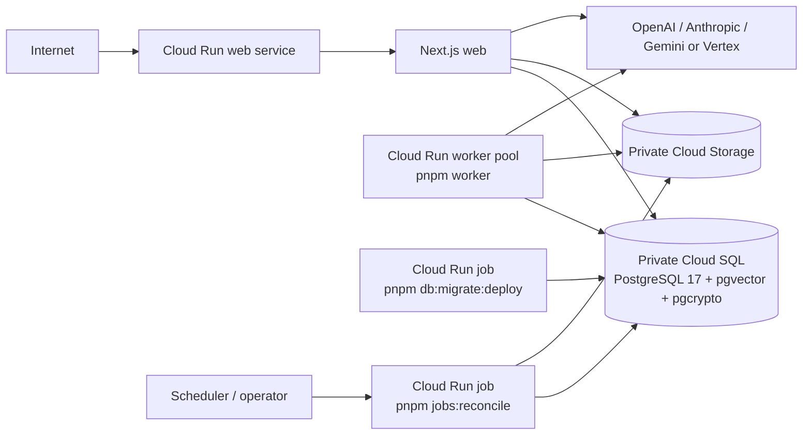

# ADR 0007: Production hosting and runtime architecture

- Status: proposed
- Date: 2026-08-22
- Complements: [ADR 0001](./0001-postgresql-prisma.md), [ADR 0002](./0002-authentication.md), and [ADR 0006](./0006-ai-orchestration-foundation.md)

## Context

SkyOS is a Node.js/Next.js 16 application backed by Prisma and PostgreSQL. It has
durable PostgreSQL background jobs, `pgvector` and `pgcrypto` migrations, a
long-running worker, provider-neutral AI calls, and private Knowledge attachment
storage. The production-readiness audit established that the current repository
does not yet supply a deployable production contract:

- the Credentials provider remains reachable even though ADR 0002 limits it to
  development;
- `LocalObjectStorage` stores attachment bodies on local disk, which cannot be
  shared safely between web and worker instances or survive ephemeral instances;
- the web workspace has no production `start` script, deployment manifest, or
  health/readiness endpoint;
- durable background work needs a continuously running process and direct
  PostgreSQL access; and
- BALANCED, DEEP, CRITICAL, and some AUTO decisions can perform several
  sequential provider calls. Each provider execution has a bounded 45-second
  deadline, but a whole request can be materially longer.

Production must retain SkyOS-owned tenancy, retrieval, citations, conversations,
telemetry, budgets, and recovery records. Provider services do not become a
database, object store, queue, or authorization boundary.

## Decision

Adopt **shape C: one Google Cloud Run platform with separate workloads built from
the same immutable SkyOS application image**, together with managed Google Cloud
data services:

- **Cloud Run service** for the public Next.js web server;
- **Cloud Run worker pool** for the non-HTTP, continuous `pnpm worker` process;
- **Cloud Run jobs** for the one-shot migrator and reconciliation workloads;
- **Cloud SQL for PostgreSQL 17** as the private system of record; and
- **Google Cloud Storage** as the future shared, private object-storage backend
  behind the existing `ObjectStorage` port.

The deployment units are independently configured and deployed, but use the same
reviewed image digest. This keeps web, worker, migration, and reconciliation
runtime dependencies consistent without requiring a Kubernetes control plane.
Cloud Run supports services, one-shot jobs, and always-on non-HTTP worker pools;
worker pools are intentionally manually scaled rather than request-autoscaled.
[Cloud Run overview](https://cloud.google.com/run/docs/overview/what-is-cloud-run)
and [worker-pool deployment documentation](https://cloud.google.com/run/docs/deploy-worker-pools)
describe those execution models.

This is a **proposed target architecture, not permission to deploy it**. It does
not remove the current release blockers.

## Alternatives considered

| Option                                                                            | Assessment                                                                                                                                                                                                                                                                                                                                                                                                   | Decision                                                                                                |
| --------------------------------------------------------------------------------- | ------------------------------------------------------------------------------------------------------------------------------------------------------------------------------------------------------------------------------------------------------------------------------------------------------------------------------------------------------------------------------------------------------------ | ------------------------------------------------------------------------------------------------------- |
| A. Serverless Next.js web, separate worker, managed PostgreSQL and object storage | The web can work as a function-style deployment, but its timeout, connection, worker, identity, and storage contracts would be split across platforms. Vercel Functions can run for plan-dependent periods, but still need a separate always-on worker and a separate private database/storage/identity design. [Vercel function duration](https://vercel.com/docs/functions/configuring-functions/duration) | Rejected: workable, but it increases operational boundaries for the first production release.           |
| B. Separate containerized web and worker on unrelated platforms                   | Can meet the functional requirements, but requires separate deployment, identity, networking, logging, and rollback conventions.                                                                                                                                                                                                                                                                             | Rejected: no demonstrated advantage over a single managed container platform.                           |
| C. Cloud Run service, worker pool, and jobs with Cloud SQL and Cloud Storage      | Provides an HTTPS Node service, continuous non-HTTP worker, one-shot jobs, attached identities, private managed database/storage, and the closest operational path to the existing Vertex integration.                                                                                                                                                                                                       | Selected.                                                                                               |
| GKE Autopilot with separate Deployment and Jobs                                   | Meets the runtime model and offers broad control, but introduces Kubernetes operations before SkyOS has demonstrated that Cloud Run worker-pool scaling is insufficient.                                                                                                                                                                                                                                     | Deferred: revisit only for custom autoscaling, sidecars, or workload constraints Cloud Run cannot meet. |

Vertex workload identity is a meaningful integration advantage, but not the sole
reason for the choice. The deciding factors are compatible runtime types, bounded
long-request support, separate worker lifecycle, direct private database access,
shared storage, and a single identity/observability model.

## Runtime units

### Web

- Runs the Next.js production server as a public Cloud Run service. The required
  repository follow-up is an explicit production start command (expected shape:
  `next start`) and a container build contract. No current root or web `start`
  script exists, so this unit must not be deployed until that is added and tested.
- Starts with a non-zero minimum instance count only after cost, cold-start, and
  database connection budgets are reviewed. Set a finite maximum instance count
  before launch to protect PostgreSQL and provider quotas.
- Starts with a request timeout that covers FAST plus database/retrieval time,
  with a bounded margin. Cloud Run defaults to five minutes and can be configured
  up to sixty minutes, but a long timeout does not make a synchronous browser
  request durable. [Cloud Run request timeouts](https://cloud.google.com/run/docs/configuring/request-timeout)
- Uses direct private database connectivity, private object-storage access, and
  outbound HTTPS to approved providers. It receives only its runtime service
  identity and the secrets/configuration it needs.
- Must eventually expose separate liveness and readiness checks. Readiness must
  prove that the process can serve requests and perform a bounded database
  dependency check without exposing internal details. The present repository has
  neither endpoint; deployment is blocked until the health contract is added.

### Worker

- Runs `pnpm worker` in a Cloud Run worker pool, with
  `BACKGROUND_JOB_MODE=durable`. It has no public endpoint.
- Starts with one manually provisioned worker instance. Increase worker instances
  only from measured queue depth, job duration, CPU/memory, provider limits, and
  the PostgreSQL connection budget. Cloud Run worker pools do not autoscale
  automatically; a future autoscaling decision is separate.
- Uses the existing PostgreSQL `FOR UPDATE SKIP LOCKED` claims, lease, heartbeat,
  and recovery records. `BACKGROUND_WORKER_ID` should normally be left unset so
  the existing hostname/PID identity remains unique per process; never deploy a
  shared static worker id.
- Handles `SIGTERM` by stopping new claims and disconnecting Prisma. Cloud Run
  may terminate a worker after its shutdown window, so a job in progress must be
  recoverable by the existing lease expiration path. Before launch, set lease,
  heartbeat, handler-duration, and platform shutdown values coherently and test a
  rolling worker replacement.
- Requires the same private database and object-storage access as web, plus
  provider outbound access for enabled embedding/processing paths.

### Migrator

- Runs once as a Cloud Run Job, using the exact reviewed release image and the
  command `pnpm db:migrate:deploy`.
- Runs before a web/worker revision that requires the new schema. It must never
  run `prisma migrate dev` or `pnpm db:seed`.
- Uses a dedicated migration identity with only the database privileges required
  to apply reviewed migrations and required extensions. Application runtime
  identities must not receive schema-alteration privileges.

### Reconciliation

- Runs `pnpm jobs:reconcile` as an operator-triggered or scheduled Cloud Run Job.
- Recommended initial cadence is daily, with an operator run after worker,
  database, or object-storage incidents. It remains **report-only**; the optional
  expired-lease repair mode is an explicit, separately approved operation.
- Uses a read-oriented identity and private database/object-storage access. It
  must not become an automatic destructive cleanup mechanism.

## Data, storage, and database

### Database

Cloud SQL for PostgreSQL 17 is the selected managed database. PostgreSQL 17 is a
currently supported Cloud SQL major version, and Cloud SQL supports managed
PostgreSQL extensions subject to its allowlist and privileged extension creation.
The platform qualification must verify the exact `vector` and `pgcrypto`
extensions, versions, migration SQL, and privileges in the selected region before
any production cutover. See [Cloud SQL PostgreSQL versions](https://cloud.google.com/sql/docs/postgres/db-versions)
and [supported extensions](https://cloud.google.com/sql/docs/postgres/extensions).

- The database has no public network endpoint. Web, worker, migrator, and
  reconciliation use private connectivity and separate database roles.
- Enable automated backups and point-in-time recovery where the chosen Cloud SQL
  configuration supports it; test restore into an isolated environment before
  launch. Backups do not replace tested application recovery.
- Use separate application, migration, and operational-read identities. The app
  identity performs only application DML and required function execution; the
  migrator owns reviewed DDL/extension creation; the reconciler has only the
  minimum read/explicit-repair permissions it needs.
- Define a finite connection cap per web instance and per worker instance. Before
  deployment, prove: `web max instances × web pool cap + worker replicas × worker
pool cap + migrator + reconciliation + operational reserve <= 70% of the
database connection limit`. PrismaPg and its transaction/worker claim paths
  must be tested against the chosen private endpoint and any pooler. Do not place
  transaction-pooling infrastructure in front of PostgreSQL until it is verified
  with Prisma transactions and `SKIP LOCKED` claims.

### Object storage

Google Cloud Storage is the selected production implementation target for the
existing key-based `ObjectStorage` interface. PostgreSQL remains authoritative for
attachment metadata, authorization, checksum, status, and `storageKey`; object
storage contains only binary bodies.

- A future GCS adapter must preserve `putObject`, `getObject`, and `deleteObject`
  semantics, server-side generated relative keys, create-only writes, missing-key
  handling, and checksum verification. The current key shape is
  `<workspaceId>/<documentId>/<attachmentId><extension>`; it is an opaque storage
  identity, not a client path or filename.
- Web writes uploads through the adapter; workers read the same object by trusted
  `storageKey`; download authorization remains in SkyOS and streams or issues a
  short-lived private signed download only after `knowledge.read` is checked.
- The bucket is private by default, encrypted at rest, restricted to dedicated
  web/worker/reconciliation identities, and never exposed as a public bucket.
- Define lifecycle retention, versioning/backup, legal-hold, object deletion, and
  orphan/missing-object reconciliation before production uploads. PostgreSQL and
  object storage cannot commit atomically, so the adapter must retain existing
  compensation and reconciliation behavior.

`LocalObjectStorage` and `KNOWLEDGE_STORAGE_ROOT` are development-only. The next
implementation task must add and test a GCS/S3-compatible production adapter and
its configuration boundary before any attachment-enabled production launch.

## Identity, ingress, and secrets

- Internet ingress terminates TLS at the Cloud Run web service/load balancer and
  exposes only the web application. The worker pool, migrator, reconciliation,
  database, and storage bucket are not public ingress surfaces.
- Bind distinct attached workload identities to web, worker, migrator, and
  reconciliation. Grant each only its needed Cloud SQL, storage, Secret Manager,
  logging/metrics, and (where applicable) Vertex permissions. No checked-in keys,
  user ADC, local `gcloud` session, or long-lived JSON service-account key is
  allowed in production.
- Gemini Vertex uses Google Application Default Credentials from its attached
  runtime identity with `GEMINI_TRANSPORT=vertex`, `GOOGLE_CLOUD_PROJECT`, and
  `GOOGLE_CLOUD_LOCATION`. The runtime identity needs only the reviewed Vertex
  inference permissions in the selected project/location. A developer API key is
  not used for that transport.
- Store secrets in Secret Manager or an equivalent runtime secret facility and
  inject them only into the workload that needs them. Configuration is versioned
  deployment metadata or an equivalent controlled runtime-config source. Never
  put secrets in images, source, build logs, client bundles, or `.env` files.
- Restrict outbound egress to DNS/HTTPS and approved provider endpoints where the
  network design permits. Provider calls stay server-side; no provider credential
  crosses the browser boundary.

### Production authentication boundary

Credentials are disabled in production and unknown runtimes by a fail-closed code
policy. Production deployment is nevertheless **blocked** until an approved
production identity provider exists. This ADR does not select or implement that
IdP. The follow-up must decide OAuth/OIDC or enterprise SSO, account
linking/provisioning, verified identity lifecycle, trusted host and callback
policy, MFA, and whether SCIM/enterprise provisioning is required. The canonical
production hostname must be explicitly trusted by Auth.js; callback redirects
remain validated relative application paths, not host-derived absolute URLs.

## Production environment contract

All values are server-only. The table names configuration classes, not values.
Blank means deliberately absent, not a default.

| Variables                                                                                                                                                                                           | Source and production rule                                                                                                                                                                               |
| --------------------------------------------------------------------------------------------------------------------------------------------------------------------------------------------------- | -------------------------------------------------------------------------------------------------------------------------------------------------------------------------------------------------------- |
| `DATABASE_URL`                                                                                                                                                                                      | Per-workload Secret Manager value for the private application role. The migrator receives its distinct migration-role URL. Never a public, development, or test URL.                                     |
| `AUTH_SECRET`                                                                                                                                                                                       | Web-only Secret Manager value, rotated under an approved session-invalidation runbook.                                                                                                                   |
| `AI_PROVIDER`, `AI_MODEL`, `AI_CHAT_MODE`                                                                                                                                                           | Controlled non-secret deployment configuration. Initial launch sets `AI_CHAT_MODE=FAST`; provider/model must be an approved registered identity.                                                         |
| `OPENAI_API_KEY`, `ANTHROPIC_API_KEY`, `GEMINI_API_KEY`                                                                                                                                             | Provider-specific Secret Manager values, injected only when that API-key transport is enabled. Do not inject unused provider secrets. `GEMINI_API_KEY` remains absent for Vertex transport.              |
| `GEMINI_TRANSPORT`, `GOOGLE_CLOUD_PROJECT`, `GOOGLE_CLOUD_LOCATION`                                                                                                                                 | Controlled non-secret Vertex configuration. Vertex relies on the attached runtime identity, not a key file.                                                                                              |
| `BACKGROUND_JOB_MODE`, `BACKGROUND_WORKER_ID`, `BACKGROUND_JOB_POLL_MS`, `BACKGROUND_JOB_RECOVERY_MS`, `BACKGROUND_JOB_LEASE_MS`, `BACKGROUND_JOB_BACKOFF_BASE_MS`, `BACKGROUND_JOB_BACKOFF_MAX_MS` | Worker configuration. Set mode to `durable`; use a unique runtime-generated worker ID unless a deployment system can inject a unique value. Values must satisfy existing parser bounds.                  |
| `KNOWLEDGE_MAX_FILE_SIZE_BYTES`, `KNOWLEDGE_SEARCH_*`, `KNOWLEDGE_RETRIEVAL_*`                                                                                                                      | Controlled non-secret limits. `KNOWLEDGE_STORAGE_ROOT` is prohibited with the local adapter; a future storage adapter will define its own bucket/prefix configuration.                                   |
| `EMBEDDING_PROVIDER`                                                                                                                                                                                | Controlled non-secret provider selection. Current `local` deterministic embeddings are not a production semantic-quality decision; select, review, and deploy a production embedding adapter separately. |
| `AI_BUDGET_*`, `AI_COST_*`, `AI_INPUT_TOKEN_MEASUREMENT`                                                                                                                                            | Controlled non-secret budget/estimation configuration. Treat changes as reviewed deployment changes because they affect enforcement, confirmation, and telemetry.                                        |
| `AI_BALANCED_*`, `AI_DEEP_*`, `AI_CRITICAL_*` provider/model/model-version triples                                                                                                                  | Controlled non-secret role-independent assignments. Keep unset while the initial production policy is FAST-only; validate all exact identities before enabling a deeper mode.                            |

The following variables are forbidden in production images, services, jobs, and
secret stores: `AUTH_DEV_EMAIL`, `AUTH_DEV_PASSWORD`, `DATABASE_TEST_URL`,
`POSTGRES_TEST_*`, `SKYOS_DEV_ALLOWED_ORIGINS`, `SKYOS_ALLOW_LIVE_AI_DEV`,
`SKYOS_ALLOW_LIVE_AI_EVAL`, `SKYOS_NEXT_DIST_DIR`, and
`AUTH_E2E_DATABASE_ADMIN_URL`. Production must never seed automatically.

## AI execution launch policy

Choose **policy B: enable only FAST for the first production launch**. A FAST
request has one bounded provider call. BALANCED, DEEP, CRITICAL, and AUTO are
disabled by deployment configuration until SkyOS has durable resumable AI
orchestration, browser reconnection semantics, idempotent request handling, and
an operational timeout/cancellation design for multi-call execution.

Cloud Run can be configured for much longer requests, but its own documentation
warns that a client connection can be lost and a new request may reach another
instance. That is unsuitable as the durability mechanism for current sequential
multi-model orchestration. [Cloud Run timeout guidance](https://cloud.google.com/run/docs/configuring/request-timeout)
therefore supports keeping the smallest launch surface to FAST rather than
treating a high timeout as a solution.

Provider outages remain safe application failures: no candidate/intermediate text
is promoted, citation allowlists remain server-owned, and usage/cost stays null
when provider telemetry is unavailable. Vertex readiness remains contingent on
the selected region/model, attached identity, and external verification at
deployment time.

## Deployment, migration, and rollback

1. Build, scan, test, and publish one immutable image digest after the repository
   validation suite passes. Do not use mutable release tags as the deployment
   authority.
2. Verify the selected region's Cloud SQL PostgreSQL 17, `pgvector`, `pgcrypto`,
   private connectivity, object-storage adapter, attached identities, and secret
   access in a non-production environment.
3. Take/verify a database backup and run the reviewed migrator job with
   `pnpm db:migrate:deploy`. Approval is required before this step.
4. Deploy a backward-compatible web revision, then the worker-pool revision;
   validate health/readiness, database connectivity, object-storage access, and
   worker claim/lease behavior without seeding data.
5. Route production traffic only after deployment checks pass. Enable the
   reconciliation schedule after the worker is healthy.

Migrations are forward-only and reviewed. Use expand/contract changes for
zero-downtime releases: first add compatible structures, deploy code that can
read both shapes, backfill/verify separately, then remove old structures in a
later approved release. A failed migration stops rollout and is investigated from
the recorded error; it is not repaired by `migrate dev`, reset, seed, or an
unreviewed destructive rollback.

To roll back a failed web or worker revision, return traffic/worker-pool rollout
to the last compatible image only after confirming it is compatible with the
already-applied schema. Schema rollback is exceptional and requires a reviewed
forward recovery migration or a tested restore plan. Object-storage and database
restores are coordinated incident operations, never ordinary deployment rollback.

## Failure model and scale guardrails

| Failure                                    | Required response                                                                                                                            |
| ------------------------------------------ | -------------------------------------------------------------------------------------------------------------------------------------------- |
| Web revision fails readiness               | Stop traffic migration; retain the previous schema-compatible revision; investigate logs/health without exposing secrets.                    |
| Worker revision fails or is terminated     | Stop new rollout; leases expire and are recovered by a healthy worker; inspect immutable attempts and run report-only reconciliation.        |
| Migration fails                            | Halt application rollout; preserve evidence; use an approved forward fix or tested restore plan, never development migration tooling.        |
| Provider outage/timeout                    | Return existing safe failure behavior; do not fabricate an answer, promote an intermediate result, or retry without existing bounded policy. |
| Object-storage outage                      | Fail upload/download/worker work safely; preserve metadata and use reconciliation for missing/orphan evidence.                               |
| Database outage                            | Fail closed; no in-memory tenancy, authorization, budget, or job state substitutes for PostgreSQL.                                           |
| Held budget reservation or unresolved cost | Use the existing recovery/holds operations and evidence-ledger workflow; no automatic settlement/release during deployment.                  |

Initial scaling is deliberately conservative: finite web max instances and
concurrency based on measured CPU/memory and the database budget; one worker
instance with measured manual scale-out; a single migrator job; and low-frequency
reconciliation. Cloud Run worker pools consume capacity while active, object
storage grows with retained attachments/versions, and provider calls remain the
dominant variable AI cost. Precise capacity and dollar commitments require load,
connection, storage-retention, and provider-usage measurements; this ADR makes no
unverified cost claim.

## Consequences and follow-up tasks

This decision gives SkyOS a concrete, portable-container deployment shape while
keeping PostgreSQL and object storage behind application-owned interfaces. It also
introduces operational work before a production launch can occur.

Required follow-ups, in order:

1. **Production authentication boundary:** select and implement a production IdP,
   then define trusted host/callback/MFA policy.
2. **Production object storage:** implement and test a private GCS-compatible
   `ObjectStorage` adapter, storage configuration, upload/download access,
   lifecycle, and reconciliation behavior.
3. **Deployment contract:** add a production image/start command, health and
   readiness endpoints, Cloud Run service/worker-pool/job manifests or IaC, and
   validated database connection limits.
4. **Production database qualification:** prove Cloud SQL PostgreSQL 17 extension,
   migration, private-connectivity, backup/PITR, and role-separation behavior.
5. **Durable AI orchestration:** make deeper modes restartable before enabling
   BALANCED/DEEP/CRITICAL/AUTO in production.
6. **Observability and operations:** add structured logs, metrics, alerts, worker
   health, and tested deployment/incident runbooks.

## External verification record

The platform facts above were reviewed on 2026-08-22 from official documentation:

- [Cloud Run services, jobs, and worker pools](https://cloud.google.com/run/docs/overview/what-is-cloud-run)
- [Cloud Run worker-pool resource model](https://cloud.google.com/run/docs/resource-model)
- [Cloud Run request timeouts](https://cloud.google.com/run/docs/configuring/request-timeout)
- [Cloud SQL for PostgreSQL versions](https://cloud.google.com/sql/docs/postgres/db-versions)
- [Cloud SQL PostgreSQL extensions](https://cloud.google.com/sql/docs/postgres/extensions)
- [Vercel function duration configuration](https://vercel.com/docs/functions/configuring-functions/duration)
