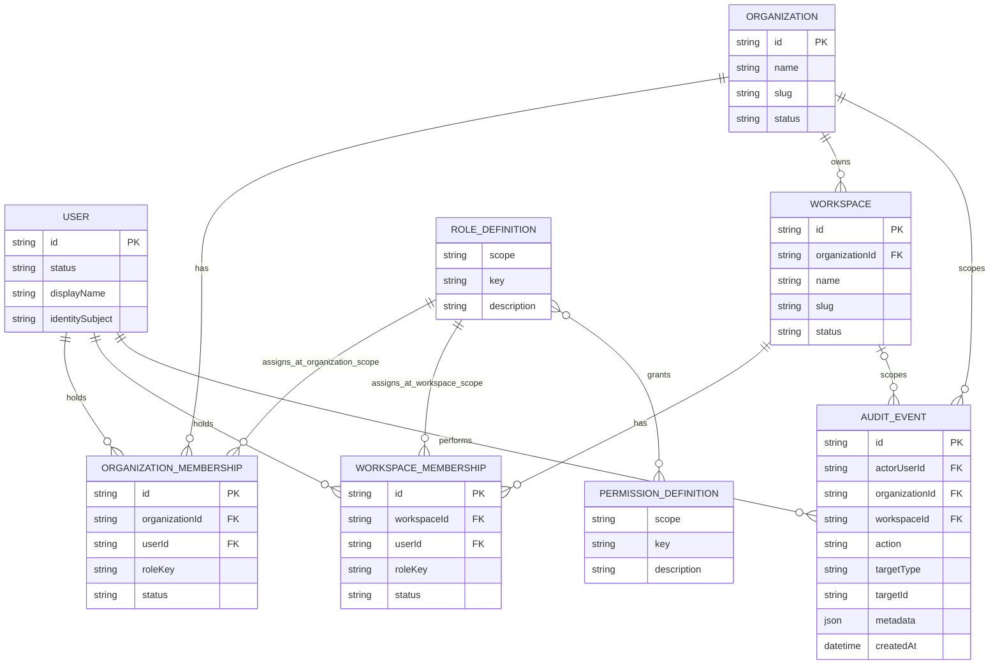

# SkyOS Initial Product Domain Model

## Purpose and scope

This document defines the initial authorization and tenancy model for the SkyOS MVP. It is a product-domain design, not a database schema or implementation contract. It deliberately does not select an authentication provider, ORM, storage engine, API shape, or UI behavior. `RoleDefinition` and `PermissionDefinition` are application-owned policy definitions for the MVP; they are not tenant data and do not require database tables.

The model establishes two tenancy scopes:

1. An **organization** is the primary tenant and administrative boundary.
2. A **workspace** belongs to exactly one organization and is the boundary for product work and content.

Access is explicit, deny-by-default, and evaluated at the smallest applicable scope. An organization membership does not, by itself, grant access to workspace content.

## Domain vocabulary

| Term         | Meaning                                                                                          |
| ------------ | ------------------------------------------------------------------------------------------------ |
| User         | A SkyOS actor with a stable internal identifier. Identity verification is outside this model.    |
| Organization | The top-level tenant that owns workspaces, membership administration, and organization settings. |
| Workspace    | An organization-owned work boundary for future product data and collaboration.                   |
| Membership   | A scoped, revocable relationship between a user and an organization or workspace.                |
| Role         | A named, built-in bundle of permissions assigned through a membership.                           |
| Permission   | A stable capability key evaluated against either organization or workspace scope.                |

## Entity model

Every persisted record has an immutable opaque `id`, `createdAt`, and `updatedAt` unless noted otherwise. Timestamps are UTC. Invitations, billing, teams, service accounts, and resource-level sharing are intentionally outside the MVP model. `AuditEvent` is a persisted, append-only operational record for privileged state transitions; it is not a user-facing product feature.

### User

**Responsibility:** represent a person or future service actor that can hold memberships.

| Attribute         | Notes                                                                                             |
| ----------------- | ------------------------------------------------------------------------------------------------- |
| `id`              | Stable internal actor identifier.                                                                 |
| `status`          | `active`, `suspended`, or `deactivated`. Only `active` users can authorize.                       |
| `displayName`     | Optional presentation value; not an authorization input.                                          |
| `identitySubject` | Optional future reference to an external identity subject. No provider is selected by this model. |

**Relationships:** a user may have many organization memberships and many workspace memberships.

**Lifecycle:** a user is provisioned as `active`; it may be `suspended` temporarily or `deactivated` permanently. Deactivation removes effective access without requiring membership deletion. The record remains for attribution.

### Organization

**Responsibility:** act as the primary tenant, administrative scope, and owner of workspaces.

| Attribute         | Notes                                                           |
| ----------------- | --------------------------------------------------------------- |
| `id`              | Immutable tenant identifier.                                    |
| `name`            | Human-readable organization name.                               |
| `slug`            | URL-safe organization identifier, unique globally while active. |
| `status`          | `active` or `archived`.                                         |
| `archivedAt`      | Set only when archived.                                         |
| `createdByUserId` | Attribution only; it does not convey ongoing authority.         |

**Relationships:** an organization has many organization memberships and many workspaces.

**Lifecycle:** creation produces an `active` organization and an active owner membership for the creator. An active organization may be archived and restored. Archiving disables authorization changes and workspace activity, except an owner restoring it. Physical deletion is not defined for the MVP.

### OrganizationMembership

**Responsibility:** grant one user a role at the organization scope.

| Attribute                   | Notes                                                                |
| --------------------------- | -------------------------------------------------------------------- |
| `id`                        | Immutable membership identifier.                                     |
| `organizationId`            | Parent organization.                                                 |
| `userId`                    | Member user.                                                         |
| `roleKey`                   | Built-in organization role: `owner`, `admin`, `member`, or `viewer`. |
| `status`                    | `active`, `suspended`, or `revoked`.                                 |
| `activatedAt` / `revokedAt` | Lifecycle timestamps.                                                |

**Relationships:** belongs to exactly one user and one organization. Its `(scope, roleKey)` resolves to an organization role definition.

**Lifecycle:** created as `active` only for an existing user. Invitation delivery and user provisioning are intentionally deferred; a future invitation flow creates or activates this membership only after identity resolution. Active memberships may be suspended, resumed, or revoked. A revoked membership is not deleted; re-access reactivates or replaces it according to the future invitation design.

### Workspace

**Responsibility:** provide an organization-scoped boundary for product content, collaboration, and future domain data.

| Attribute         | Notes                                                   |
| ----------------- | ------------------------------------------------------- |
| `id`              | Immutable workspace identifier.                         |
| `organizationId`  | Owning organization; never changes.                     |
| `name`            | Human-readable workspace name.                          |
| `slug`            | Identifier unique within its organization while active. |
| `status`          | `active` or `archived`.                                 |
| `archivedAt`      | Set only when archived.                                 |
| `createdByUserId` | Attribution only.                                       |

**Relationships:** belongs to one organization and has many workspace memberships.

**Lifecycle:** an active organization creates an active workspace. The creating user receives an active workspace `owner` membership in the same operation. An active workspace may be archived and restored by an authorized organization administrator or workspace owner. Archiving blocks product activity and membership changes except restoration.

### WorkspaceMembership

**Responsibility:** grant one organization member a role for one workspace's product scope.

| Attribute                   | Notes                                                             |
| --------------------------- | ----------------------------------------------------------------- |
| `id`                        | Immutable membership identifier.                                  |
| `workspaceId`               | Parent workspace.                                                 |
| `userId`                    | Member user.                                                      |
| `roleKey`                   | Built-in workspace role: `owner`, `admin`, `member`, or `viewer`. |
| `status`                    | `active`, `suspended`, or `revoked`.                              |
| `activatedAt` / `revokedAt` | Lifecycle timestamps.                                             |

**Relationships:** belongs to exactly one user and one workspace. Its `(scope, roleKey)` resolves to a workspace role definition.

**Lifecycle:** may be created only when the user has an active organization membership in the workspace's organization. It follows the same active, suspend, resume, and revoke lifecycle as organization membership. Suspending or revoking the parent organization membership immediately makes the workspace membership ineffective for authorization, but does not automatically delete, revoke, or otherwise mutate the workspace membership record. If the parent membership is later active again, the workspace membership can become effective only if its own status and the workspace status are also active.

### AuditEvent

**Responsibility:** retain an immutable record of a protected organization or workspace mutation for accountability and investigation.

| Attribute        | Notes                                                                                               |
| ---------------- | --------------------------------------------------------------------------------------------------- |
| `id`             | Immutable event identifier.                                                                         |
| `actorUserId`    | User that authorized and performed the protected operation.                                         |
| `organizationId` | Organization tenancy scope, always present.                                                         |
| `workspaceId`    | Workspace scope when applicable; absent for organization-only operations.                           |
| `action`         | Stable, application-owned action key, such as `workspace.created` or `organization.archived`.       |
| `targetType`     | Stable entity type key for the affected organization, workspace, or membership.                     |
| `targetId`       | Immutable identifier of the affected entity.                                                        |
| `metadata`       | Structured, non-secret contextual data, including relevant before/after state and transfer parties. |
| `createdAt`      | UTC timestamp assigned when the event is inserted.                                                  |

**Relationships:** belongs to exactly one actor user and organization, and optionally one workspace. It does not replace the target entity's current state.

**Lifecycle:** an event is created in the same transaction as its protected mutation. It can never be updated or deleted through SkyOS application services; database controls also reject row updates and deletes. Event retention and privileged database-administrator access remain operational-policy decisions.

### RoleDefinition

**Responsibility:** define a built-in, scoped bundle of permissions.

| Attribute              | Notes                                                         |
| ---------------------- | ------------------------------------------------------------- |
| `scope`                | `organization` or `workspace`.                                |
| `key`                  | `owner`, `admin`, `member`, or `viewer`; unique with `scope`. |
| `name` / `description` | Presentation and documentation metadata.                      |
| `permissionKeys`       | Immutable catalog mapping for the current policy version.     |

**Relationships:** one role definition is referenced logically by many memberships and grants many permission definitions.

**Lifecycle:** roles are seeded, application-owned policy definitions, not tenant-managed or database-persisted records. Custom roles, per-organization role edits, and role inheritance are out of scope. Future policy changes must version permission mappings; role keys must not be reused with unrelated meaning.

### PermissionDefinition

**Responsibility:** name one stable, scoped capability.

| Attribute      | Notes                                                                  |
| -------------- | ---------------------------------------------------------------------- |
| `scope`        | `organization` or `workspace`.                                         |
| `key`          | Stable dotted capability key, unique globally.                         |
| `description`  | Human-readable explanation.                                            |
| `deprecatedAt` | Optional; a deprecated key must remain interpretable during migration. |

**Relationships:** a permission is granted logically by zero or more role definitions. The role-to-permission association is a fixed application policy catalog for the MVP, not a tenant-editable or database-persisted entity.

**Lifecycle:** permissions are application-owned policy definitions, not database records. Permission keys are additive. Keys are never silently renamed or repurposed. New product resources add new keys before they add enforcement.

## Relationships and cardinality

The diagram shows `RoleDefinition` and `PermissionDefinition` as logical policy concepts, not required persisted entities. In the application-owned policy catalog, `(scope, key)` identifies distinct role definitions: for example, `organization:admin` and `workspace:admin` are separate definitions with different grants.

## Permission catalog

Permissions are scoped deliberately. An organization permission may administer organization-owned workspace containers, but it does not grant access to the future content inside a workspace. Workspace permissions authorize work and content only within one workspace.

### Organization-level permissions

| Permission                        | Meaning                                                                                                                                                           |
| --------------------------------- | ----------------------------------------------------------------------------------------------------------------------------------------------------------------- |
| `organization.read`               | Read organization profile and membership directory metadata.                                                                                                      |
| `organization.update`             | Update organization profile and settings.                                                                                                                         |
| `organization.archive`            | Archive or restore the organization.                                                                                                                              |
| `organization.transfer_ownership` | Assign or transfer the final owner authority.                                                                                                                     |
| `organization.members.read`       | Read organization memberships.                                                                                                                                    |
| `organization.members.manage`     | Create, suspend, resume, revoke, and assign non-owner organization memberships.                                                                                   |
| `organization.workspaces.read`    | Enumerate all workspace metadata in the organization; this is granted only to organization owners and admins.                                                     |
| `organization.workspaces.create`  | Create a workspace.                                                                                                                                               |
| `organization.workspaces.manage`  | Archive, restore, and administer workspace memberships without gaining workspace-content access; role-management limits depend on the caller's organization role. |

### Workspace-level permissions

| Permission                 | Meaning                                                                      |
| -------------------------- | ---------------------------------------------------------------------------- |
| `workspace.read`           | Read workspace metadata.                                                     |
| `workspace.update`         | Update workspace metadata and settings.                                      |
| `workspace.archive`        | Archive or restore the workspace.                                            |
| `workspace.members.read`   | Read workspace memberships.                                                  |
| `workspace.members.manage` | Create, suspend, resume, revoke, and assign non-owner workspace memberships. |
| `knowledge.read`           | Read future knowledge resources within the workspace.                        |
| `knowledge.write`          | Create or modify future knowledge resources within the workspace.            |
| `tasks.read`               | Read future task resources within the workspace.                             |
| `tasks.write`              | Create or modify future task resources within the workspace.                 |
| `ai.use`                   | Use future AI features within the workspace.                                 |

The `knowledge`, `tasks`, and `ai` keys reserve stable authorization boundaries for the stated MVP domains. They do not imply that those features, APIs, or resources exist yet.

## Initial role policy

The same four role keys exist at each scope, but they are distinct scoped role definitions. Permissions omitted from a role are denied.

### Organization roles

| Role     | Grants                                                                                                                                                                                                      |
| -------- | ----------------------------------------------------------------------------------------------------------------------------------------------------------------------------------------------------------- |
| `owner`  | All organization permissions.                                                                                                                                                                               |
| `admin`  | `organization.read`, `organization.update`, `organization.members.read`, `organization.members.manage`, `organization.workspaces.read`, `organization.workspaces.create`, `organization.workspaces.manage`. |
| `member` | `organization.read`. Workspace discovery is limited to workspaces where this user has an active workspace membership.                                                                                       |
| `viewer` | `organization.read`. Workspace discovery is limited to workspaces where this user has an active workspace membership.                                                                                       |

### Workspace roles

| Role     | Grants                                                                                        |
| -------- | --------------------------------------------------------------------------------------------- |
| `owner`  | All workspace permissions.                                                                    |
| `admin`  | All workspace permissions except `workspace.archive`.                                         |
| `member` | `workspace.read`, `knowledge.read`, `knowledge.write`, `tasks.read`, `tasks.write`, `ai.use`. |
| `viewer` | `workspace.read`, `knowledge.read`, `tasks.read`.                                             |

### Organization authority over workspace membership roles

`organization.workspaces.manage` authorizes organization-level administration of workspace memberships; it does not grant workspace-content permissions. Its role-management boundary is fixed for the MVP:

- An organization `owner` may assign, change, suspend, resume, revoke, remove, or demote any workspace role, including workspace `owner`, subject to the last-workspace-owner invariant.
- An organization `admin` may manage only workspace `admin`, `member`, and `viewer` memberships. An organization admin may not assign a workspace `owner`, or change an owner's role or status, including removing, demoting, suspending, revoking, or restoring an owner.
- An organization `member` or `viewer` has no organization-level authority to manage workspace memberships.
- A workspace `owner` may manage roles within that workspace, subject to the same owner-protection invariants. A workspace `admin` may manage only non-owner workspace memberships.

### Workspace discovery

Workspace discovery is separate from workspace-content authorization:

- An active organization `owner` or `admin` may enumerate all workspaces in that organization through `organization.workspaces.read`.
- An active organization `member` or `viewer` may discover only workspaces in that organization where the user also has an active workspace membership.
- A suspended, revoked, or inactive parent organization membership makes all workspace memberships ineffective and removes the workspace from membership-based discovery without deleting those membership records.

## Authorization evaluation

Authorization is a pure decision over trusted request context and the current policy catalog. A future implementation must not trust a user-supplied organization ID, workspace ID, role, or permission.

1. Resolve the authenticated actor to an active SkyOS user. Authentication is outside this model.
2. Resolve the target scope from the requested resource, never from client-selected scope alone.
3. Deny if the organization or workspace is not active.
4. For an organization request, require an active organization membership and a role grant for the requested organization permission.
5. For workspace discovery, allow an organization owner or admin to enumerate the full organization directory. For an organization member or viewer, filter the directory to workspaces where the actor has an active workspace membership.
6. For a workspace-content request, require all of the following:
   - an active user;
   - an active organization membership in the workspace's organization;
   - an active workspace membership for the target workspace; and
   - a grant for the requested workspace permission.
7. For organization-level workspace administration, evaluate the organization permission (`organization.workspaces.*`) and enforce the caller's organization-role boundary for the target workspace role; do not use a workspace-content permission.
8. Deny by default if any relationship, status, role-management boundary, or grant is missing.

Organization `owner` and `admin` can administer workspace containers and assignments through organization permissions, but neither automatically receives `knowledge.read`, `tasks.write`, `ai.use`, or any other workspace-content permission. They may add an explicit workspace membership for themselves when required by an authorized administration workflow.

## Authorization examples

| Request                                                                               | Decision | Reason                                                                                                                            |
| ------------------------------------------------------------------------------------- | -------- | --------------------------------------------------------------------------------------------------------------------------------- |
| An organization owner creates a workspace.                                            | Allow    | The owner has `organization.workspaces.create`; creation atomically gives that user workspace `owner`.                            |
| An organization member opens knowledge in a workspace without a workspace membership. | Deny     | Organization membership does not grant `knowledge.read`; active workspace membership is required.                                 |
| A workspace viewer creates a task.                                                    | Deny     | `viewer` has `tasks.read`, not `tasks.write`.                                                                                     |
| A workspace admin archives its workspace.                                             | Deny     | `workspace.archive` is reserved for workspace `owner`; organization workspace management may still apply at organization scope.   |
| An organization admin suspends a workspace member.                                    | Allow    | The admin has `organization.workspaces.manage` and may manage non-owner workspace roles without gaining workspace content access. |
| An organization admin removes a workspace owner.                                      | Deny     | Organization admins cannot change a workspace owner's role or status.                                                             |
| An organization owner transfers a workspace owner role.                               | Allow    | Organization owners may manage all workspace membership roles, subject to preserving an active workspace owner.                   |
| A suspended organization member reads an otherwise active workspace.                  | Deny     | Parent organization membership must be active for all workspace authorization.                                                    |
| An organization admin archives the organization.                                      | Deny     | `organization.archive` is owner-only.                                                                                             |

## Invariants

These rules must be enforced transactionally by any future persistence and authorization implementation.

1. Every workspace belongs to exactly one organization; `organizationId` is immutable.
2. Every active workspace membership requires an active organization membership for the same user in the workspace's organization.
3. At least one active organization `owner` must exist for every active organization. The final owner cannot be suspended, revoked, or demoted until another active owner exists.
4. At least one active workspace `owner` must exist for every active workspace. The final workspace owner cannot be suspended, revoked, or demoted until another active owner exists.
5. Only an organization owner can assign, revoke, or transfer organization `owner`. An admin cannot create an owner.
6. Only an organization owner or workspace owner can assign, remove, demote, suspend, revoke, resume, or restore a workspace `owner`; an organization admin cannot change a workspace owner's role or status.
7. A user has at most one current organization membership per organization and at most one current workspace membership per workspace. Reinstatement must not create concurrent active memberships.
8. The parent and actor identifiers on a membership are immutable after creation: `organizationId` and `userId` on an organization membership, and `workspaceId` and `userId` on a workspace membership, cannot be reassigned.
9. Membership role keys must resolve to an application-owned role definition with the same scope; an organization role cannot be assigned to a workspace membership, or vice versa.
10. Role and permission checks are always server-side in a future implementation. Client-side visibility is never authorization.
11. Archived organizations and workspaces deny normal access and mutation. Restoration is the only permitted state transition while archived.
12. Slugs are unique among active organizations globally and among active workspaces within an organization. Historical slug reuse requires an explicit future retention decision.
13. No permission is granted by a stale, suspended, revoked, or deactivated relationship.
14. Each privileged organization or workspace mutation in the audit scope must insert its immutable audit event in the same transaction. Audit event rows are append-only: application services and database controls reject updates and deletes.

## Production-readiness audit requirement

The foundation persists an append-only audit event for workspace creation, organization and workspace archive or restoration, organization and workspace role changes, membership suspension, resumption, or revocation, and ownership transfer. Each event records the acting user, organization scope, optional workspace scope, action, target, timestamp, and structured non-secret metadata. The privileged service writes the event in the same transaction as the state transition, so either both writes commit or both roll back. New privileged operations must join this audited service boundary before release.

## Assumptions

- SkyOS begins as a multi-tenant product with organizations as top-level tenants.
- A user may belong to multiple organizations and multiple workspaces.
- A workspace is never shared across organizations.
- The MVP needs fixed roles and permissions only; `RoleDefinition` and `PermissionDefinition` remain application-owned policy definitions and do not require database tables.
- Workspace-content access is deliberately explicit to avoid accidental broad access when an organization grows.
- The actor that creates an organization is assigned its first owner membership in the same atomic operation.
- The actor that creates a workspace is assigned its first workspace owner membership in the same atomic operation.

## Risks and unresolved decisions

| Area                     | Open decision / risk                                                                                                                                                 |
| ------------------------ | -------------------------------------------------------------------------------------------------------------------------------------------------------------------- |
| Identity lifecycle       | Define how external identities, verified email, invitations, SCIM, and account recovery map to `User` and membership activation.                                     |
| Owner recovery           | Define a break-glass or support-controlled owner-recovery process; the invariant prevents accidental loss but does not solve lost-owner scenarios.                   |
| Deletion and retention   | Specify legal retention, anonymization, slug reuse, audit-event retention, and whether records are ever hard-deleted.                                                |
| Service actors           | Decide whether automation uses `User`, a separate service-account entity, or delegated tokens. Do not overload human membership semantics without a policy decision. |
| Cross-workspace features | Future global search, analytics, and AI may need an explicit aggregate permission model; they must not bypass workspace checks.                                      |
| Resource-level sharing   | Document-level, task-level, guest, external collaborator, and link-sharing access are intentionally excluded and should be modeled separately.                       |
| Role evolution           | Define migration/versioning rules before granting new permissions to existing roles, particularly for sensitive future domains.                                      |

## Extension path

The MVP can evolve without changing its tenancy boundaries:

1. Add resource-specific permissions under the existing organization or workspace scope.
2. Introduce a persisted role-permission association and tenant-defined roles only after role administration is a product requirement.
3. Add invitation and identity-provisioning entities without changing active membership semantics.
4. Add service accounts or groups as separate actor/principal abstractions, then reuse the same scoped authorization evaluator.
5. Extend the audit action catalog and retention controls as additional privileged administration flows are introduced.
