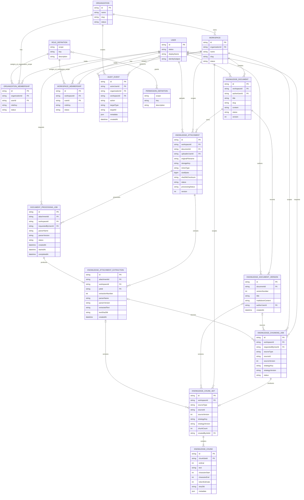

# SkyOS Initial Product Domain Model

## Purpose and scope

This document defines the initial authorization and tenancy model for the SkyOS MVP. It is a product-domain design, not a database schema or implementation contract. It deliberately does not select an authentication provider, ORM, storage engine, API shape, or UI behavior. `RoleDefinition` and `PermissionDefinition` are application-owned policy definitions for the MVP; they are not tenant data and do not require database tables.

The model establishes two tenancy scopes:

1. An **organization** is the primary tenant and administrative boundary.
2. A **workspace** belongs to exactly one organization and is the boundary for product work and content.

Access is explicit, deny-by-default, and evaluated at the smallest applicable scope. An organization membership does not, by itself, grant access to workspace content.

## Domain vocabulary

| Term                       | Meaning                                                                                          |
| -------------------------- | ------------------------------------------------------------------------------------------------ |
| User                       | A SkyOS actor with a stable internal identifier. Identity verification is outside this model.    |
| Organization               | The top-level tenant that owns workspaces, membership administration, and organization settings. |
| Workspace                  | An organization-owned work boundary for future product data and collaboration.                   |
| Knowledge document         | A workspace-scoped Markdown record of durable operational knowledge.                             |
| Knowledge document version | An immutable snapshot of a document revision used for history and restoration.                   |
| Knowledge attachment       | Workspace-scoped metadata and a protected binary object attached to one knowledge document.      |
| Document processing job    | Durable request to extract plain text from one PDF or DOCX attachment.                           |
| Attachment extraction      | Immutable, parser-versioned plain-text result produced by one successful processing job.         |
| Knowledge chunking job     | Durable, audited request to chunk one pinned Markdown version or attachment extraction.          |
| Knowledge chunk set        | Immutable, strategy-versioned collection linked to one exact source version.                     |
| Knowledge chunk            | One deterministic ordinal text range within an immutable chunk set.                              |
| Membership                 | A scoped, revocable relationship between a user and an organization or workspace.                |
| Role                       | A named, built-in bundle of permissions assigned through a membership.                           |
| Permission                 | A stable capability key evaluated against either organization or workspace scope.                |

## Entity model

Every persisted record has an immutable opaque `id`, `createdAt`, and `updatedAt` unless noted otherwise. Timestamps are UTC. Invitations, billing, teams, service accounts, and resource-level sharing are intentionally outside the MVP model. `AuditEvent` is a persisted, append-only operational record for privileged state transitions; it is not a user-facing product feature.

### User

**Responsibility:** represent a person or future service actor that can hold memberships.

| Attribute         | Notes                                                                                             |
| ----------------- | ------------------------------------------------------------------------------------------------- |
| `id`              | Stable internal actor identifier.                                                                 |
| `status`          | `active`, `suspended`, or `deactivated`. Only `active` users can authorize.                       |
| `displayName`     | Optional presentation value; not an authorization input.                                          |
| `identitySubject` | Optional future reference to an external identity subject. No provider is selected by this model. |

**Relationships:** a user may have many organization memberships and many workspace memberships.

**Lifecycle:** a user is provisioned as `active`; it may be `suspended` temporarily or `deactivated` permanently. Deactivation removes effective access without requiring membership deletion. The record remains for attribution.

### Organization

**Responsibility:** act as the primary tenant, administrative scope, and owner of workspaces.

| Attribute         | Notes                                                           |
| ----------------- | --------------------------------------------------------------- |
| `id`              | Immutable tenant identifier.                                    |
| `name`            | Human-readable organization name.                               |
| `slug`            | URL-safe organization identifier, unique globally while active. |
| `status`          | `active` or `archived`.                                         |
| `archivedAt`      | Set only when archived.                                         |
| `createdByUserId` | Attribution only; it does not convey ongoing authority.         |

**Relationships:** an organization has many organization memberships and many workspaces.

**Lifecycle:** creation produces an `active` organization and an active owner membership for the creator. An active organization may be archived and restored. Archiving disables authorization changes and workspace activity, except an owner restoring it. Physical deletion is not defined for the MVP.

### OrganizationMembership

**Responsibility:** grant one user a role at the organization scope.

| Attribute                   | Notes                                                                |
| --------------------------- | -------------------------------------------------------------------- |
| `id`                        | Immutable membership identifier.                                     |
| `organizationId`            | Parent organization.                                                 |
| `userId`                    | Member user.                                                         |
| `roleKey`                   | Built-in organization role: `owner`, `admin`, `member`, or `viewer`. |
| `status`                    | `active`, `suspended`, or `revoked`.                                 |
| `activatedAt` / `revokedAt` | Lifecycle timestamps.                                                |

**Relationships:** belongs to exactly one user and one organization. Its `(scope, roleKey)` resolves to an organization role definition.

**Lifecycle:** created as `active` only for an existing user. Invitation delivery and user provisioning are intentionally deferred; a future invitation flow creates or activates this membership only after identity resolution. Active memberships may be suspended, resumed, or revoked. A revoked membership is not deleted; re-access reactivates or replaces it according to the future invitation design.

### Workspace

**Responsibility:** provide an organization-scoped boundary for product content, collaboration, and future domain data.

| Attribute         | Notes                                                   |
| ----------------- | ------------------------------------------------------- |
| `id`              | Immutable workspace identifier.                         |
| `organizationId`  | Owning organization; never changes.                     |
| `name`            | Human-readable workspace name.                          |
| `slug`            | Identifier unique within its organization while active. |
| `status`          | `active` or `archived`.                                 |
| `archivedAt`      | Set only when archived.                                 |
| `createdByUserId` | Attribution only.                                       |

**Relationships:** belongs to one organization and has many workspace memberships and knowledge documents.

**Lifecycle:** an active organization creates an active workspace. The creating user receives an active workspace `owner` membership in the same operation. An active workspace may be archived and restored by an authorized organization administrator or workspace owner. Archiving blocks product activity and membership changes except restoration.

### KnowledgeDocument

**Responsibility:** retain one Markdown-only knowledge record within exactly one workspace.

| Attribute      | Notes                                                                                                 |
| -------------- | ----------------------------------------------------------------------------------------------------- |
| `id`           | Immutable document identifier.                                                                        |
| `workspaceId`  | Immutable parent workspace identifier; a document is never moved between workspaces.                  |
| `authorUserId` | User that created the document; retained for attribution.                                             |
| `title`        | Required human-readable title.                                                                        |
| `slug`         | Workspace-local URL identifier, unique within the workspace.                                          |
| `content`      | Unmodified Markdown source. Generated content, comments, and sharing metadata are outside this model. |
| `status`       | `active` or `archived`.                                                                               |
| `archivedAt`   | Set while archived.                                                                                   |
| `version`      | Positive revision counter used for optimistic concurrency on updates and state transitions.           |

**Relationships:** belongs to exactly one workspace and one author user, and may have many attachment metadata records. The workspace relationship supplies the organization tenancy boundary; a document never has an independently assignable organization.

**Lifecycle:** an actor with an effective workspace `knowledge.write` grant creates an active document. Actors with `knowledge.read` may read active documents, while `knowledge.write` is required to update, archive, or restore. Active documents appear in normal lists; archived documents are omitted and may only be restored through an authorized, version-checked operation. A stale update or transition fails without overwriting a newer version.

### KnowledgeDocumentVersion

**Responsibility:** preserve an immutable Markdown snapshot for every successful revision-bearing document mutation.

| Attribute         | Notes                                                                                 |
| ----------------- | ------------------------------------------------------------------------------------- |
| `id`              | Immutable version-record identifier.                                                  |
| `documentId`      | Immutable parent document identifier.                                                 |
| `versionNumber`   | Positive revision number, unique within the document.                                 |
| `title`           | Title captured at this revision.                                                      |
| `markdownContent` | Unmodified Markdown source captured at this revision.                                 |
| `authorUserId`    | Actor responsible for this revision, including a restore operation.                   |
| `createdAt`       | Append timestamp. Version records have no `updatedAt` because they cannot be changed. |

**Relationships:** belongs to exactly one knowledge document and one author user. Workspace and organization scope are derived only through the parent document, and all reads resolve that parent inside the effective selected workspace.

**Lifecycle:** document creation appends version 1. Each content update and each archive or restore transition that advances the document concurrency counter appends the matching snapshot in the same transaction. Restoring historical content requires `knowledge.write`, verifies the expected current version, copies the selected historical title and Markdown into the active document, increments its version, and appends a new snapshot. Historical rows are never overwritten, deleted, or branched. The current document `version` must equal the greatest stored `versionNumber`.

**Rendering boundary:** the stored Markdown source is never interpreted as MDX or arbitrary React components. Presentation uses CommonMark with raw HTML disabled, sanitized output, safe URL-scheme validation, no embedded remote images, and safe `rel` attributes on external HTTP(S) links. Scripts, iframes, forms, event-handler attributes, and executable URL schemes are not rendered.

**Search boundary:** active document titles and Markdown source are indexed with a PostgreSQL-generated `tsvector` and partial GIN index. Every search first requires effective `knowledge.read` access and binds the selected `workspaceId` in the database query. Archived documents are excluded. Search indexes are derived data and do not modify the stored Markdown source.

### KnowledgeAttachment

**Responsibility:** retain protected metadata for one binary file attached to exactly one knowledge document and workspace.

| Attribute          | Notes                                                                                                   |
| ------------------ | ------------------------------------------------------------------------------------------------------- |
| `id`               | Immutable server-generated UUID.                                                                        |
| `workspaceId`      | Immutable workspace scope; must equal the parent document's workspace.                                  |
| `documentId`       | Immutable parent knowledge document.                                                                    |
| `uploaderUserId`   | Immutable user attribution for the original upload.                                                     |
| `originalFilename` | Validated display filename only; never used as a local path or object key.                              |
| `storageKey`       | Immutable, globally unique object key generated from trusted server identifiers and the validated type. |
| `mimeType`         | One allowed MVP type: PDF, DOCX, PNG, or JPEG.                                                          |
| `sizeBytes`        | Positive binary size measured by the server and constrained by configurable application policy.         |
| `sha256Checksum`   | Lowercase SHA-256 digest of the stored bytes.                                                           |
| `status`           | `active` or `archived`.                                                                                 |
| `processingStatus` | `uploaded`, `processing`, `processed`, or `failed`; independent from archive lifecycle.                 |
| `archivedAt`       | Set only while archived.                                                                                |
| `version`          | Positive optimistic-concurrency counter incremented by archive and restore transitions.                 |
| `createdAt`        | Upload metadata timestamp.                                                                              |
| `updatedAt`        | Latest lifecycle transition timestamp.                                                                  |

**Relationships:** belongs to exactly one document, workspace, and uploader user. A composite foreign key from `(documentId, workspaceId)` to the parent document prevents cross-workspace attachment metadata even if application validation is bypassed.

**Lifecycle:** `knowledge.write` uploads an active attachment with processing status `uploaded`. Archive and restore are audited, version-checked metadata transitions; the binary remains stored so an archived attachment can be restored. PDF or DOCX processing independently moves `uploaded`, `processed`, or `failed` to `processing`, then to `processed` or `failed`. Normal lists and downloads include active attachments only. `knowledge.read` is sufficient to list and download active files. There is no hard-delete service in the MVP.

**Validation boundary:** the upload service rejects empty or oversized content; unsafe or traversal-style filenames; unsupported extensions or MIME types; mismatched extension/MIME pairs; and content whose signature does not match the declared type. SHA-256 rejects duplicate active content within one document while allowing the same content in another document. DOCX upload validation identifies the ZIP signature and required package paths; post-upload processing performs the separate text parse.

**Storage boundary:** metadata is stored in PostgreSQL; bytes are accessed only through a key-based `ObjectStorage` interface. The development adapter canonicalizes its configured root, validates each key segment, rejects absolute/backslash/traversal keys and symlink escapes, and never derives paths from client filenames. These semantics allow a later S3-compatible adapter without changing the domain service. Downloads re-check size and checksum, require effective workspace authorization, and are forced as non-HTML attachments.

**Consistency boundary:** filesystem and PostgreSQL cannot share a transaction. Upload stages a server-keyed binary first, then inserts metadata and its immutable audit event in one short database transaction. A failed transaction triggers compensating deletion of the staged binary. A process crash can still leave an unreachable staged object, so production storage requires reconciliation. No metadata is exposed until its audit event commits.

### DocumentProcessingJob

**Responsibility:** persist and coordinate one deterministic text-extraction attempt for one attachment.

| Attribute           | Notes                                                                                                |
| ------------------- | ---------------------------------------------------------------------------------------------------- |
| `id`                | Immutable job UUID.                                                                                  |
| `attachmentId`      | Immutable parent attachment.                                                                         |
| `workspaceId`       | Immutable workspace scope constrained to the attachment workspace.                                   |
| `requestedByUserId` | Actor that held `knowledge.write` when the job was created.                                          |
| `parserName`        | Application-selected parser implementation captured at request time.                                 |
| `parserVersion`     | Exact parser and SkyOS normalization version captured at request time.                               |
| `status`            | `queued`, `processing`, `succeeded`, or `failed`.                                                    |
| `errorMessage`      | Safe, non-sensitive failure summary on a failed job; raw parser errors are not persisted or exposed. |
| `createdAt`         | Queue timestamp.                                                                                     |
| `startedAt`         | Worker claim timestamp.                                                                              |
| `completedAt`       | Terminal success or failure timestamp.                                                               |

**Relationships:** belongs to exactly one attachment, workspace, and requesting user. A successful job produces exactly one attachment extraction; a failed job produces none.

**Lifecycle:** an effective `knowledge.write` request creates a queued job and immutable request audit event in one transaction. A queue adapter dispatches its identifier; development uses a synchronous adapter while production may introduce a broker-backed adapter. A worker claims the job, moves the attachment to `processing`, and records a start event in a short transaction. Binary I/O and parsing occur outside transactions. Completion atomically appends an extraction, marks both job and attachment successful, and appends a success event. Failure atomically records safe failure state and a failure event. Jobs cannot move backward, be claimed twice, or be deleted through application services.

**Parser boundary:** only application-owned parser registrations may be selected; clients cannot choose parser names or versions. PDF processing extracts an existing text layer and does not use OCR. DOCX processing extracts raw text and never renders the package as HTML. Line endings, Unicode normalization, trailing whitespace, and excessive blank lines are normalized by a versioned deterministic policy.

### KnowledgeAttachmentExtraction

**Responsibility:** retain one immutable plain-text result without changing the original binary or any earlier result.

| Attribute          | Notes                                                                                |
| ------------------ | ------------------------------------------------------------------------------------ |
| `id`               | Immutable extraction UUID.                                                           |
| `attachmentId`     | Immutable parent attachment.                                                         |
| `workspaceId`      | Immutable workspace scope constrained to the attachment workspace.                   |
| `jobId`            | Unique successful processing job that created this row.                              |
| `extractionNumber` | Positive attachment-local sequence, unique and increasing across reprocessing.       |
| `parserName`       | Parser implementation copied from the job.                                           |
| `parserVersion`    | Parser and normalization version copied from the job.                                |
| `extractedText`    | Deterministically normalized plain text, stored separately from the original object. |
| `textSha256`       | SHA-256 of the UTF-8 extracted text for repeatability checks.                        |
| `createdAt`        | Append timestamp; extraction rows have no `updatedAt` because they are immutable.    |

**Relationships:** belongs to exactly one attachment and successful job. Workspace and organization access remain derived from and constrained by the parent attachment.

**Lifecycle:** successful initial processing creates extraction 1. Reprocessing, including after a parser upgrade, creates the next extraction number and never overwrites history. Rows cannot be updated or deleted through application services, and database triggers reject both operations.

### KnowledgeChunkingJob

**Responsibility:** coordinate one deterministic chunking attempt against an immutable source version.

| Attribute                | Notes                                                                                            |
| ------------------------ | ------------------------------------------------------------------------------------------------ |
| `id`                     | Immutable job UUID and audit target.                                                             |
| `workspaceId`            | Immutable effective workspace scope.                                                             |
| `requestedByUserId`      | Actor that held `knowledge.write` at request time.                                               |
| `sourceType`             | `markdown_document` or `attachment_extraction`.                                                  |
| `sourceId`               | Document id for Markdown or attachment id for extracted text.                                    |
| `sourceVersion`          | Document version number or attachment extraction number.                                         |
| `documentVersionId`      | Exact immutable Markdown version when `sourceType` is `markdown_document`; otherwise absent.     |
| `attachmentExtractionId` | Exact immutable extraction when `sourceType` is `attachment_extraction`; otherwise absent.       |
| `strategyKey`            | Application-owned strategy identifier captured at request time.                                  |
| `strategyVersion`        | Exact strategy version captured at request time.                                                 |
| `status`                 | `queued`, `processing`, `succeeded`, or `failed`.                                                |
| `errorMessage`           | Safe terminal failure description; internal exception details are not persisted.                 |
| lifecycle timestamps     | `createdAt`, optional `startedAt`, and optional `completedAt`, constrained by the current state. |

**Relationships:** belongs to one workspace, requester, and exactly one typed source-version row. A successful job creates exactly one chunk set; a failed job creates none.

**Lifecycle:** an effective `knowledge.write` request pins the current document version or latest successful attachment extraction and creates a queued job with its request event. A worker claim records `processing` and its start event. Before chunking, the worker re-checks effective workspace read access and confirms that the organization, workspace, document, and optional attachment remain active. Success atomically appends the entire set, marks the job successful, and records success. Failure records a terminal safe message and failure event without partial outputs. Job identity and strategy cannot change, transitions cannot move backward, and jobs are retained.

### KnowledgeChunkSet

**Responsibility:** preserve one immutable, traceable result from a specific source and chunking strategy version.

| Attribute         | Notes                                                                                         |
| ----------------- | --------------------------------------------------------------------------------------------- |
| `id`              | Immutable chunk-set UUID.                                                                     |
| source identity   | `sourceType`, `sourceId`, `sourceVersion`, and the matching typed source-version foreign key. |
| `workspaceId`     | Immutable workspace scope, database-validated against the source.                             |
| strategy identity | Immutable `strategyKey` and `strategyVersion`.                                                |
| `chunkCount`      | Positive declared count that must equal the number of persisted child chunks at commit.       |
| `createdByJobId`  | Unique successful job that created the set.                                                   |
| `createdAt`       | Append timestamp; sets have no update lifecycle.                                              |

**Relationships:** belongs to one exact `KnowledgeDocumentVersion` or `KnowledgeAttachmentExtraction`, one workspace, and one creating job; contains one or more chunks. Database validation requires the set's source, scope, strategy, and version to exactly match its creating processing job.

**Lifecycle:** every successful processing or reprocessing attempt appends a new set, even when source text and strategy are identical. Previous sets remain readable with `knowledge.read` for audit, verification, and future migrations. Application services expose no overwrite or delete path, and database triggers reject both operations.

### KnowledgeChunk

**Responsibility:** store one deterministic text unit within a chunk set without mutating its source.

| Attribute                         | Notes                                                                                       |
| --------------------------------- | ------------------------------------------------------------------------------------------- |
| `id`                              | Immutable chunk UUID.                                                                       |
| `chunkSetId`                      | Immutable parent set.                                                                       |
| `ordinal`                         | Zero-based deterministic sequence, unique within the set.                                   |
| `text`                            | Exact, nonempty source slice; source Markdown/extraction text remains unchanged.            |
| `characterStart` / `characterEnd` | Start-inclusive and end-exclusive UTF-16 source offsets where available.                    |
| `tokenEstimate`                   | Positive deterministic estimate for planning, not a model tokenizer result.                 |
| `sha256`                          | Lowercase SHA-256 of the UTF-8 chunk text.                                                  |
| `metadata`                        | Small strategy-owned JSON such as selected boundary type; not exposed as raw UI debug data. |
| `createdAt`                       | Append timestamp; chunks have no update lifecycle.                                          |

**Strategy boundary:** strategies implement a replaceable application interface and are selected only from an application-owned registry. MVP `paragraph-window:1.0.0` emits non-overlapping ranges of at most 1,000 UTF-16 code units, preferring paragraph, line, then whitespace boundaries after 600 units. It trims boundary whitespace while retaining exact adjusted offsets, uses SHA-256 over UTF-8 text, and estimates tokens as `ceil(Unicode code points / 4)`. Identical source text and strategy version therefore produce identical ordered text, offsets, estimates, checksums, and metadata. Empty or whitespace-only text is a meaningful failure, never an empty successful set.

### WorkspaceMembership

**Responsibility:** grant one organization member a role for one workspace's product scope.

| Attribute                   | Notes                                                             |
| --------------------------- | ----------------------------------------------------------------- |
| `id`                        | Immutable membership identifier.                                  |
| `workspaceId`               | Parent workspace.                                                 |
| `userId`                    | Member user.                                                      |
| `roleKey`                   | Built-in workspace role: `owner`, `admin`, `member`, or `viewer`. |
| `status`                    | `active`, `suspended`, or `revoked`.                              |
| `activatedAt` / `revokedAt` | Lifecycle timestamps.                                             |

**Relationships:** belongs to exactly one user and one workspace. Its `(scope, roleKey)` resolves to a workspace role definition.

**Lifecycle:** may be created only when the user has an active organization membership in the workspace's organization. It follows the same active, suspend, resume, and revoke lifecycle as organization membership. Suspending or revoking the parent organization membership immediately makes the workspace membership ineffective for authorization, but does not automatically delete, revoke, or otherwise mutate the workspace membership record. If the parent membership is later active again, the workspace membership can become effective only if its own status and the workspace status are also active.

### AuditEvent

**Responsibility:** retain an immutable record of a protected organization or workspace mutation for accountability and investigation.

| Attribute        | Notes                                                                                               |
| ---------------- | --------------------------------------------------------------------------------------------------- |
| `id`             | Immutable event identifier.                                                                         |
| `actorUserId`    | User that authorized and performed the protected operation.                                         |
| `organizationId` | Organization tenancy scope, always present.                                                         |
| `workspaceId`    | Workspace scope when applicable; absent for organization-only operations.                           |
| `action`         | Stable, application-owned action key, such as `workspace.created` or `organization.archived`.       |
| `targetType`     | Stable entity type key for the affected organization, workspace, or membership.                     |
| `targetId`       | Immutable identifier of the affected entity.                                                        |
| `metadata`       | Structured, non-secret contextual data, including relevant before/after state and transfer parties. |
| `createdAt`      | UTC timestamp assigned when the event is inserted.                                                  |

**Relationships:** belongs to exactly one actor user and organization, and optionally one workspace. It does not replace the target entity's current state.

**Lifecycle:** an event is created in the same transaction as its protected mutation. It can never be updated or deleted through SkyOS application services; database controls also reject row updates and deletes. Event retention and privileged database-administrator access remain operational-policy decisions.

### RoleDefinition

**Responsibility:** define a built-in, scoped bundle of permissions.

| Attribute              | Notes                                                         |
| ---------------------- | ------------------------------------------------------------- |
| `scope`                | `organization` or `workspace`.                                |
| `key`                  | `owner`, `admin`, `member`, or `viewer`; unique with `scope`. |
| `name` / `description` | Presentation and documentation metadata.                      |
| `permissionKeys`       | Immutable catalog mapping for the current policy version.     |

**Relationships:** one role definition is referenced logically by many memberships and grants many permission definitions.

**Lifecycle:** roles are seeded, application-owned policy definitions, not tenant-managed or database-persisted records. Custom roles, per-organization role edits, and role inheritance are out of scope. Future policy changes must version permission mappings; role keys must not be reused with unrelated meaning.

### PermissionDefinition

**Responsibility:** name one stable, scoped capability.

| Attribute      | Notes                                                                  |
| -------------- | ---------------------------------------------------------------------- |
| `scope`        | `organization` or `workspace`.                                         |
| `key`          | Stable dotted capability key, unique globally.                         |
| `description`  | Human-readable explanation.                                            |
| `deprecatedAt` | Optional; a deprecated key must remain interpretable during migration. |

**Relationships:** a permission is granted logically by zero or more role definitions. The role-to-permission association is a fixed application policy catalog for the MVP, not a tenant-editable or database-persisted entity.

**Lifecycle:** permissions are application-owned policy definitions, not database records. Permission keys are additive. Keys are never silently renamed or repurposed. New product resources add new keys before they add enforcement.

## Relationships and cardinality

The diagram shows `RoleDefinition` and `PermissionDefinition` as logical policy concepts, not required persisted entities. In the application-owned policy catalog, `(scope, key)` identifies distinct role definitions: for example, `organization:admin` and `workspace:admin` are separate definitions with different grants.

## Permission catalog

Permissions are scoped deliberately. An organization permission may administer organization-owned workspace containers, but it does not grant access to the future content inside a workspace. Workspace permissions authorize work and content only within one workspace.

### Organization-level permissions

| Permission                        | Meaning                                                                                                                                                           |
| --------------------------------- | ----------------------------------------------------------------------------------------------------------------------------------------------------------------- |
| `organization.read`               | Read organization profile and membership directory metadata.                                                                                                      |
| `organization.update`             | Update organization profile and settings.                                                                                                                         |
| `organization.archive`            | Archive or restore the organization.                                                                                                                              |
| `organization.transfer_ownership` | Assign or transfer the final owner authority.                                                                                                                     |
| `organization.members.read`       | Read organization memberships.                                                                                                                                    |
| `organization.members.manage`     | Create, suspend, resume, revoke, and assign non-owner organization memberships.                                                                                   |
| `organization.workspaces.read`    | Enumerate all workspace metadata in the organization; this is granted only to organization owners and admins.                                                     |
| `organization.workspaces.create`  | Create a workspace.                                                                                                                                               |
| `organization.workspaces.manage`  | Archive, restore, and administer workspace memberships without gaining workspace-content access; role-management limits depend on the caller's organization role. |

### Workspace-level permissions

| Permission                 | Meaning                                                                      |
| -------------------------- | ---------------------------------------------------------------------------- |
| `workspace.read`           | Read workspace metadata.                                                     |
| `workspace.update`         | Update workspace metadata and settings.                                      |
| `workspace.archive`        | Archive or restore the workspace.                                            |
| `workspace.members.read`   | Read workspace memberships.                                                  |
| `workspace.members.manage` | Create, suspend, resume, revoke, and assign non-owner workspace memberships. |
| `knowledge.read`           | Read future knowledge resources within the workspace.                        |
| `knowledge.write`          | Create or modify future knowledge resources within the workspace.            |
| `tasks.read`               | Read future task resources within the workspace.                             |
| `tasks.write`              | Create or modify future task resources within the workspace.                 |
| `ai.use`                   | Use future AI features within the workspace.                                 |

The `knowledge`, `tasks`, and `ai` keys reserve stable authorization boundaries for the stated MVP domains. They do not imply that those features, APIs, or resources exist yet.

## Initial role policy

The same four role keys exist at each scope, but they are distinct scoped role definitions. Permissions omitted from a role are denied.

### Organization roles

| Role     | Grants                                                                                                                                                                                                      |
| -------- | ----------------------------------------------------------------------------------------------------------------------------------------------------------------------------------------------------------- |
| `owner`  | All organization permissions.                                                                                                                                                                               |
| `admin`  | `organization.read`, `organization.update`, `organization.members.read`, `organization.members.manage`, `organization.workspaces.read`, `organization.workspaces.create`, `organization.workspaces.manage`. |
| `member` | `organization.read`. Workspace discovery is limited to workspaces where this user has an active workspace membership.                                                                                       |
| `viewer` | `organization.read`. Workspace discovery is limited to workspaces where this user has an active workspace membership.                                                                                       |

### Workspace roles

| Role     | Grants                                                                                        |
| -------- | --------------------------------------------------------------------------------------------- |
| `owner`  | All workspace permissions.                                                                    |
| `admin`  | All workspace permissions except `workspace.archive`.                                         |
| `member` | `workspace.read`, `knowledge.read`, `knowledge.write`, `tasks.read`, `tasks.write`, `ai.use`. |
| `viewer` | `workspace.read`, `knowledge.read`, `tasks.read`.                                             |

### Organization authority over workspace membership roles

`organization.workspaces.manage` authorizes organization-level administration of workspace memberships; it does not grant workspace-content permissions. Its role-management boundary is fixed for the MVP:

- An organization `owner` may assign, change, suspend, resume, revoke, remove, or demote any workspace role, including workspace `owner`, subject to the last-workspace-owner invariant.
- An organization `admin` may manage only workspace `admin`, `member`, and `viewer` memberships. An organization admin may not assign a workspace `owner`, or change an owner's role or status, including removing, demoting, suspending, revoking, or restoring an owner.
- An organization `member` or `viewer` has no organization-level authority to manage workspace memberships.
- A workspace `owner` may manage roles within that workspace, subject to the same owner-protection invariants. A workspace `admin` may manage only non-owner workspace memberships.

### Workspace discovery

Workspace discovery is separate from workspace-content authorization:

- An active organization `owner` or `admin` may enumerate all workspaces in that organization through `organization.workspaces.read`.
- An active organization `member` or `viewer` may discover only workspaces in that organization where the user also has an active workspace membership.
- A suspended, revoked, or inactive parent organization membership makes all workspace memberships ineffective and removes the workspace from membership-based discovery without deleting those membership records.

## Authorization evaluation

Authorization is a pure decision over trusted request context and the current policy catalog. A future implementation must not trust a user-supplied organization ID, workspace ID, role, or permission.

1. Resolve the authenticated actor to an active SkyOS user. Authentication is outside this model.
2. Resolve the target scope from the requested resource, never from client-selected scope alone.
3. Deny if the organization or workspace is not active.
4. For an organization request, require an active organization membership and a role grant for the requested organization permission.
5. For workspace discovery, allow an organization owner or admin to enumerate the full organization directory. For an organization member or viewer, filter the directory to workspaces where the actor has an active workspace membership.
6. For a workspace-content request, require all of the following:
   - an active user;
   - an active organization membership in the workspace's organization;
   - an active workspace membership for the target workspace; and
   - a grant for the requested workspace permission.
7. For organization-level workspace administration, evaluate the organization permission (`organization.workspaces.*`) and enforce the caller's organization-role boundary for the target workspace role; do not use a workspace-content permission.
8. Deny by default if any relationship, status, role-management boundary, or grant is missing.

Organization `owner` and `admin` can administer workspace containers and assignments through organization permissions, but neither automatically receives `knowledge.read`, `tasks.write`, `ai.use`, or any other workspace-content permission. They may add an explicit workspace membership for themselves when required by an authorized administration workflow.

## Authorization examples

| Request                                                                               | Decision | Reason                                                                                                                            |
| ------------------------------------------------------------------------------------- | -------- | --------------------------------------------------------------------------------------------------------------------------------- |
| An organization owner creates a workspace.                                            | Allow    | The owner has `organization.workspaces.create`; creation atomically gives that user workspace `owner`.                            |
| An organization member opens knowledge in a workspace without a workspace membership. | Deny     | Organization membership does not grant `knowledge.read`; active workspace membership is required.                                 |
| A workspace viewer creates a task.                                                    | Deny     | `viewer` has `tasks.read`, not `tasks.write`.                                                                                     |
| A workspace admin archives its workspace.                                             | Deny     | `workspace.archive` is reserved for workspace `owner`; organization workspace management may still apply at organization scope.   |
| An organization admin suspends a workspace member.                                    | Allow    | The admin has `organization.workspaces.manage` and may manage non-owner workspace roles without gaining workspace content access. |
| An organization admin removes a workspace owner.                                      | Deny     | Organization admins cannot change a workspace owner's role or status.                                                             |
| An organization owner transfers a workspace owner role.                               | Allow    | Organization owners may manage all workspace membership roles, subject to preserving an active workspace owner.                   |
| A suspended organization member reads an otherwise active workspace.                  | Deny     | Parent organization membership must be active for all workspace authorization.                                                    |
| An organization admin archives the organization.                                      | Deny     | `organization.archive` is owner-only.                                                                                             |
| A workspace viewer downloads an active attachment.                                    | Allow    | The viewer has `knowledge.read`; download revalidates effective workspace access.                                                 |
| A workspace viewer uploads or archives an attachment.                                 | Deny     | Attachment writes require `knowledge.write`, which the viewer does not have.                                                      |
| A member downloads an attachment by ID from another workspace.                        | Deny     | Attachment, document, and effective selected workspace must resolve to the same tenancy scope.                                    |

## Invariants

These rules must be enforced transactionally by any future persistence and authorization implementation.

1. Every workspace belongs to exactly one organization; `organizationId` is immutable.
2. Every active workspace membership requires an active organization membership for the same user in the workspace's organization.
3. At least one active organization `owner` must exist for every active organization. The final owner cannot be suspended, revoked, or demoted until another active owner exists.
4. At least one active workspace `owner` must exist for every active workspace. The final workspace owner cannot be suspended, revoked, or demoted until another active owner exists.
5. Only an organization owner can assign, revoke, or transfer organization `owner`. An admin cannot create an owner.
6. Only an organization owner or workspace owner can assign, remove, demote, suspend, revoke, resume, or restore a workspace `owner`; an organization admin cannot change a workspace owner's role or status.
7. A user has at most one current organization membership per organization and at most one current workspace membership per workspace. Reinstatement must not create concurrent active memberships.
8. The parent and actor identifiers on a membership are immutable after creation: `organizationId` and `userId` on an organization membership, and `workspaceId` and `userId` on a workspace membership, cannot be reassigned.
9. Membership role keys must resolve to an application-owned role definition with the same scope; an organization role cannot be assigned to a workspace membership, or vice versa.
10. Role and permission checks are always server-side in a future implementation. Client-side visibility is never authorization.
11. Archived organizations and workspaces deny normal access and mutation. Restoration is the only permitted state transition while archived.
12. Slugs are unique among active organizations globally and among active workspaces within an organization. Historical slug reuse requires an explicit future retention decision.
13. No permission is granted by a stale, suspended, revoked, or deactivated relationship.
14. Each privileged organization or workspace mutation in the audit scope must insert its immutable audit event in the same transaction. Audit event rows are append-only: application services and database controls reject updates and deletes.
15. Every knowledge document belongs to exactly one workspace and its `workspaceId` cannot be reassigned. Its workspace provides the sole tenancy boundary.
16. Knowledge documents use optimistic concurrency: each update, archive, and restore checks the caller's expected `version` and increments it atomically. A stale request must not overwrite current content or state.
17. Archived knowledge documents are omitted from normal workspace lists and reject normal updates. Restore is the only permitted content-lifecycle transition while archived.
18. Knowledge Markdown rendering must discard raw HTML, sanitize the rendered tree, reject unsafe URL schemes, and never execute scripts, embedded forms, iframes, event handlers, MDX, or arbitrary React components.
19. Knowledge search requires effective `knowledge.read`, is constrained to the selected workspace in the database query, and returns active documents only. Empty or punctuation-only queries return no results.
20. Every successful mutation that increments a knowledge document's `version` appends exactly one immutable `KnowledgeDocumentVersion` with the same version number in the transaction. The document version equals the greatest stored version number.
21. Knowledge version rows are append-only. Application services and database triggers reject updates and deletes; a historical restore creates the next version and never modifies the selected source row.
22. Version history reads require effective `knowledge.read` in the parent document's workspace. Historical restore additionally requires `knowledge.write`, an active document, and a matching expected current version.
23. Every knowledge attachment belongs to exactly one knowledge document and workspace. `documentId`, `workspaceId`, `uploaderUserId`, `storageKey`, checksum, size, MIME type, and original filename cannot be reassigned after creation.
24. The attachment `(documentId, workspaceId)` must reference a document with the same workspace. Storage keys are generated only from trusted server identifiers and validated extensions; client filenames and paths never influence object location.
25. Attachment upload accepts only PDF, DOCX, PNG, and JPEG when extension, declared MIME type, and binary signature agree. Empty, traversal-style, unsupported, or oversized inputs are rejected before metadata creation.
26. A document may have at most one active attachment for a SHA-256 checksum. The same checksum may exist in another document or in archived history; restoring a duplicate is rejected while matching active content exists.
27. Active attachment reads and downloads require effective `knowledge.read`. Upload, archive, and restore require effective `knowledge.write`; an archived parent document rejects attachment writes.
28. Attachment archive and restore check the expected positive `version` and increment it atomically. Archived attachments are excluded from normal lists and downloads.
29. Attachment metadata creation and lifecycle changes insert their immutable audit events in the same database transaction. Upload makes metadata reachable only after that transaction commits and removes the staged binary on ordinary transaction failure.
30. Downloads use stored server metadata, force attachment disposition, disable MIME sniffing and shared caching, and verify stored size and SHA-256. Missing or corrupt binaries fail safely without deleting metadata or bypassing authorization.
31. Attachment archive lifecycle and text-processing state are orthogonal. Processing does not increment the attachment lifecycle version or make an archived attachment downloadable.
32. Only active PDF and DOCX attachments on active documents may be requested for processing, and the request requires effective `knowledge.write` in the attachment workspace. Extraction reads require effective `knowledge.read` in that same workspace.
33. At most one queued or processing job may exist for an attachment. Job identity, workspace, attachment, requester, parser name, parser version, and creation timestamp are immutable; status transitions only move `queued` to `processing` and then to `succeeded` or `failed`.
34. A worker verifies the original binary's stored size and SHA-256 before parsing. Missing, corrupt, unsupported, or unparseable inputs fail safely without modifying the original object or creating an extraction.
35. Each successful job appends exactly one immutable extraction with the next attachment-local extraction number. Reprocessing never updates or deletes earlier extracted text, even when the parser version changes.
36. Extraction creation, the job's successful terminal state, the attachment's `processed` state, and the success audit event commit atomically. Failure state and its failure audit event also commit atomically.
37. Parser selection is application-owned and captured on the job and extraction. Deterministic output normalization is part of the parser version; clients cannot supply or override parser identity.
38. Chunking requests require effective `knowledge.write`; chunk-set and chunk metadata reads require effective `knowledge.read` and always constrain the query by workspace.
39. A chunking job pins exactly one immutable source row: the current `KnowledgeDocumentVersion` or latest successful `KnowledgeAttachmentExtraction`. Its logical source id, source version, workspace, requester, typed source reference, and strategy identity cannot change.
40. Only active, readable workspace content is chunkable. The organization, workspace, document, and optional attachment must be active when the worker runs; parent archival or ineffective membership produces a terminal failure and no output set.
41. A successful chunking job creates exactly one nonempty immutable set. Re-chunking always creates a new job and set; old sets and chunks remain queryable and cannot be updated or deleted through application services or database writes.
42. Every set's source identity and strategy identity must equal its creating job, and its declared positive `chunkCount` must equal the persisted child-row count at transaction commit.
43. For identical source text and strategy key/version, ordered chunk text, ordinals, offsets, token estimates, checksums, and metadata are deterministic. Strategy behavior changes require a new version; clients cannot choose or override strategy identity.
44. Empty or whitespace-only source text fails with a safe meaningful terminal state, a failure audit event, and no chunk set or partial chunk rows.
45. Chunking request and start state each commit with the matching audit event. Successful set and chunk creation, successful terminal state, and success audit event commit atomically; failure state and its failure audit event also commit atomically.

## Production-readiness audit requirement

The foundation persists an append-only audit event for workspace creation, organization and workspace archive or restoration, organization and workspace role changes, membership suspension, resumption, or revocation, ownership transfer, knowledge document creation and lifecycle changes, attachment upload, archive, or restoration, document-processing request, start, success, or failure, and chunking request, start, success, or failure. Each event records the acting user, organization scope, optional workspace scope, action, target, timestamp, and structured non-secret metadata. The privileged service writes the event in the same transaction as the metadata state transition, so either both writes commit or both roll back. New privileged operations must join this audited service boundary before release.

## Assumptions

- SkyOS begins as a multi-tenant product with organizations as top-level tenants.
- A user may belong to multiple organizations and multiple workspaces.
- A workspace is never shared across organizations.
- The MVP needs fixed roles and permissions only; `RoleDefinition` and `PermissionDefinition` remain application-owned policy definitions and do not require database tables.
- Workspace-content access is deliberately explicit to avoid accidental broad access when an organization grows.
- The actor that creates an organization is assigned its first owner membership in the same atomic operation.
- The actor that creates a workspace is assigned its first workspace owner membership in the same atomic operation.

## Risks and unresolved decisions

| Area                     | Open decision / risk                                                                                                                                                                                                                                                                                                                           |
| ------------------------ | ---------------------------------------------------------------------------------------------------------------------------------------------------------------------------------------------------------------------------------------------------------------------------------------------------------------------------------------------- |
| Identity lifecycle       | Define how external identities, verified email, invitations, SCIM, and account recovery map to `User` and membership activation.                                                                                                                                                                                                               |
| Owner recovery           | Define a break-glass or support-controlled owner-recovery process; the invariant prevents accidental loss but does not solve lost-owner scenarios.                                                                                                                                                                                             |
| Deletion and retention   | Specify legal retention, anonymization, slug reuse, audit-event retention, and whether records are ever hard-deleted.                                                                                                                                                                                                                          |
| Service actors           | Decide whether automation uses `User`, a separate service-account entity, or delegated tokens. Do not overload human membership semantics without a policy decision.                                                                                                                                                                           |
| Cross-workspace features | Future global search, analytics, and AI may need an explicit aggregate permission model; they must not bypass workspace checks.                                                                                                                                                                                                                |
| Resource-level sharing   | Document-level, task-level, guest, external collaborator, and link-sharing access are intentionally excluded and should be modeled separately.                                                                                                                                                                                                 |
| Role evolution           | Define migration/versioning rules before granting new permissions to existing roles, particularly for sensitive future domains.                                                                                                                                                                                                                |
| Knowledge lifecycle      | Define formal retention, export, legal-hold, and immutable-history growth policies before expanding document capabilities. Future Markdown extensions must preserve the current sanitization boundary.                                                                                                                                         |
| Binary storage           | Local disk is development-only. Production requires durable S3-compatible storage, encryption and access policy, coordinated database/object backups, orphan reconciliation, and lifecycle retention.                                                                                                                                          |
| File security            | Signature checks reduce accidental spoofing but are not malware detection. Virus scanning, content disarm, quarantine, and administrator incident workflows remain required before untrusted production uploads.                                                                                                                               |
| Upload consistency       | PostgreSQL and object storage cannot commit atomically. Compensating deletion handles ordinary failures, but crash recovery needs a scheduled reconciliation process for staged or missing objects.                                                                                                                                            |
| Document processing      | PDF text extraction is layout-lossy and image-only PDFs yield empty text without OCR. Production needs queue delivery/retry policy, worker resource limits and sandboxing, parser-version retention, malformed-file hardening, and operational recovery for jobs stranded in `processing`.                                                     |
| Knowledge chunking       | The MVP character-window strategy and token estimate are deterministic but not model-tokenizer-aware or linguistically optimized. Production needs queue retry/idempotency policy, stranded-job recovery, strategy-version retention, scale limits for large histories, and an explicit retention/migration policy before downstream indexing. |

## Extension path

The MVP can evolve without changing its tenancy boundaries:

1. Add resource-specific permissions under the existing organization or workspace scope.
2. Introduce a persisted role-permission association and tenant-defined roles only after role administration is a product requirement.
3. Add invitation and identity-provisioning entities without changing active membership semantics.
4. Add service accounts or groups as separate actor/principal abstractions, then reuse the same scoped authorization evaluator.
5. Extend the audit action catalog and retention controls as additional privileged administration flows are introduced.
6. Add OCR, comments, sharing, embeddings, or AI features only with explicit document-level security and retention decisions.
